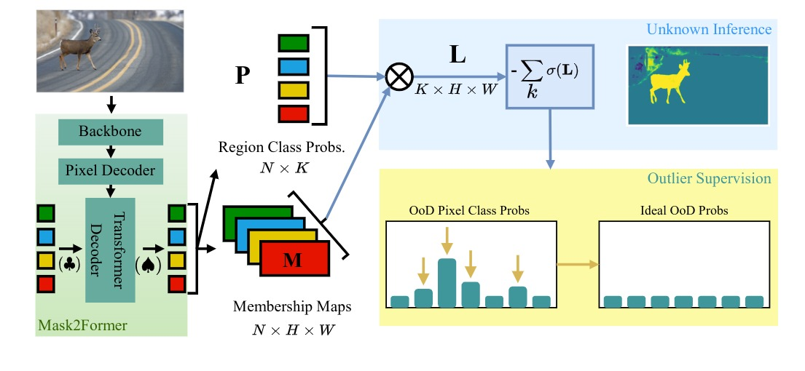

# RbA: Segmenting Unknown Regions Rejected by All 

[Nazir Nayal](https://nazirnayal.xyz/), [Mısra Yavuz](https://scholar.google.com/citations?user=lfU8AYUAAAAJ&hl=en), [João Henriques](https://www.robots.ox.ac.uk/~joao/), [Fatma Güney](https://alexander-kirillov.github.io/)

[[`arXiv`](https://arxiv.org/abs/2211.14293)] [[`Project`](https://bowenc0221.github.io/mask2former)] [[`BibTeX`](#CitingRbA)]


<div align="center">
  
</div><br/>


## Updates
* code with training and evaluation scripts are available

## Installation

See [installation instructions](INSTALL.md) for necessary installations and setup


## Datasets Preparation

See [Dataset Preparation](datasets/README.md) for details on downloading and preparing datasets for both training and evaluation.

## Model Zoo and Baselines

We provide the checkpoints and config files used to train RbA under different configurations in the [RbA Model Zoo](MODEL_ZOO.md).


## Training

  In order to replicate any of our experiments, we provide the config files for all the models in the [RbA Model Zoo](MODEL_ZOO.md). Given the config file, a training experiment can be run using the following command:

  ```
  python train_net.py \
  --config-file PATH_TO_CONFIG_FILE \
  --num-gpus    NUM_GPUS \
  OUTPUT_DIR    PATH_TO_STORE_CKPTS_AND_LOGS
  ```

  For example, to train a Swin-B model with 1 decoder layer, on 4 gpus and store the outputs in a folder named `model_logs/swin_b_1dl` you can use the following:

  ```
  python train_net.py \
  --config-file configs/cityscapes/semantic-segmentation/swin/single_decoder_layer/maskformer2_swin_base_IN21k_384_bs16_90k_1dl.yaml \
  --num-gpus 4 \
  OUTPUT_DIR  model_logs/swin_b_1dl/
  ```

NOTE: some experiments require the model to be initialized from pretrained weights, make sure the required weights are available under the `pretrained/` folder. Details about the require pretrained weights can be found in [RbA Model Zoo](MODEL_ZOO.md).


## Evaluation

  We provide `evaluate_ood.py` for evaluating on OoD datasets. A simple usage for the script is as follows:

  ```
  python evaluate_ood.py 
    --out_path results_test/ \  # folder to store results as pkl files
    --models_folder ckpts/ \
    --datasets_folder PATH_TO_DATASETS_ROOT \
    --model_mode all \  # evaluates all models in the models_folder
    --dataset_mode all \ # evaluate on all datasets (RA & FS LaF)
  ```

  The script assumes the following:

  * The OoD datasets are setup as described in [Datasets Prepration](datasets/README.md)
  * The parameter `--models_folder` is a path to a folder that contains multiple folders, where each folder corresponds to a model. In a model's folder the scripts expects to files: 1) `config.yaml` and its checkpoint 2) `model_final.pth`. Setting up the models is explained in [RbA Model Zoo Introduction](MODEL_ZOO.md#introduction)

  The scripts supports more finegrained options like selecting subsets of the models in a folder or the datasets. Please check `evaluate_ood.py` for descriptions of the options.


## <a name="CitingRbA"></a>Citing RbA

If you use RbA in your research, please use the following BibTeX entry.

```BibTeX
@misc{nayal2023rba,
      title={RbA: Segmenting Unknown Regions Rejected by All}, 
      author={Nazir Nayal and Mısra Yavuz and João F. Henriques and Fatma Güney},
      year={2023},
      eprint={2211.14293},
      archivePrefix={arXiv},
      primaryClass={cs.CV}
}
```

## Acknowledgement

This repo is built mainly on top Mask2Former repo: (https://github.com/facebookresearch/Mask2Former).

Different code snippets are also adapted from the following repos:
* [PEBAL](https://github.com/tianyu0207/PEBAL)
* [DenseHybrid](https://github.com/matejgrcic/DenseHybrid)
* [EOSPN](https://github.com/jd730/EOPSN)

We thank all of the authors of these repos for their contributions.
